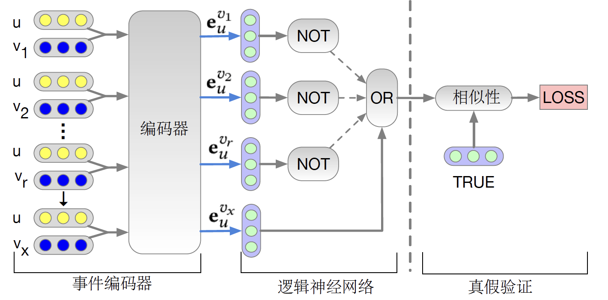
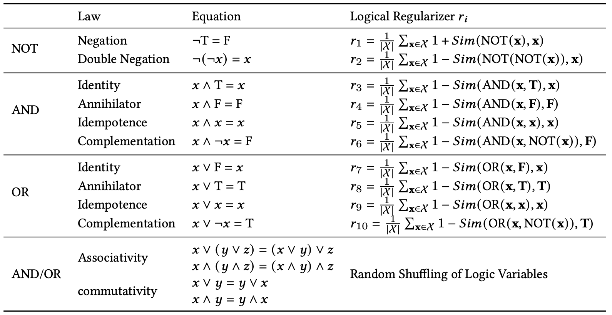

# NCR-Paddle

English | [简体中文](./README_cn.md)

----


----

## 1 Introduction

This project is an implementation of [Neural Collaborative Reasoning](https://arxiv.org/pdf/2005.08129.pdf) based on the
PaddlePaddle Framework by Baidu. The NCR project using logical regularization to constrain simple two-layer neural
network's behaviors and archives reasoning in user-item uid_embeddings space.

### Abstract

Existing Collaborative Filtering (CF) methods are mostly designed based on the idea of matching, i.e., by learning user
and item embed- dings from data using shallow or deep models, they try to capture the associative relevance patterns in
data, so that a user embedding can be matched with relevant item embeddings using designed or learned similarity
functions. However, as a cognition rather than a perception intelligent task, recommendation requires not only the
ability of pattern recognition and matching from data, but also the ability of cognitive reasoning in data.

**Model architecture**



**Embedding and logical module using two full connect layers**


**Using logical regularization to train OR and NOT module**



**Paper:**

- [1] Chen, H. , Shi, S. , Y Li, & Y Zhang. (2020). Neural collaborative reasoning.<br>

**References project：**

- [https://github.com/rutgerswiselab/NCR](https://github.com/rutgerswiselab/NCR)

**AIStudio：**

- jupyter
  notebook：[https://aistudio.baidu.com/aistudio/projectdetail/2336922](https://aistudio.baidu.com/aistudio/projectdetail/2336922)

## 2 Metric

> NCR model evaluation metric on ML100k dataset

| |N@5|N@10|HR@5|HR@10|
| :---: | :---: | :---: | :---: | :---: |
|ML100k|0.3794|0.4369|0.5446|0.7208|

**Pretrained model：**
[Weight](saved_model/NCR/0.3653_0.4254_0.5287_0.7144best_test.model)

## 3 Environment

- hardware：GPU、CPU

- requirements：
    - PaddlePaddle = 2.1.2
    - numpy==1.18.1
    - pandas==0.24.2
    - scipy==1.3.0
    - tqdm==4.32.1
    - scikit_learn==0.23.1

## 4 Dataset

Interactions in the datasets are sorted by original timestamp. All the interactions in train comes earlier than those in validation, and then earlier than those in test set. We do positive leave-one-out to keep the last user positive interaction (with rating >3) in the test set. The second to the last positive interaction is in validation set. To guarantee that we do not have cold start problem, we put all the interactions of users who with less than 5 interactions in train set only.

For interactions with label 0 in test sets are not used for evaluation. You can ignore those records since we only want to recommend the items that a user do want to buy. For interactions with label 0 in validation set are also not used for evaluation. However, we need to keep this information in the file so that the negative feedback information can be used as part of the sequence for recommending the item in the test set.


## 5 Quick start

### Step1: clone

```bash
# clone this repo
git clone https://github.com/gsq7474741/Paddle-NCR
```

**install requirements**

```bash
pip install -r requirements.txt
```

### Step2: train

```bash
python ./main.py --rank 1 --model_name NCR --optimizer Adam --lr 0.001 --dataset ml100k01-1-5 --metric ndcg@5,ndcg@10,hit@5,hit@10 --max_his 5 --test_neg_n 100 --l2 1e-4 --r_weight 0.1 --random_seed 1 --gpu 1
```

output:

```
Test Before Training = 0.0243,0.0432,0.0393,0.0987 ndcg@5,ndcg@10,hit@5,hit@10
Prepare Train Data...
Prepare Validation Data...
Init: 	 train= 0.8473,0.8473 validation= 0.0276,0.0463,0.0393,0.0977 test= 0.0243,0.0432,0.0393,0.0987 [6.9 s] ndcg@5,ndcg@10,hit@5,hit@10
Optimizer: Adam
Epoch     1:   5%|██▌                                              | 22/416 [00:04<01:17,  5.07it/s]
```

### Step3: evaluate & predict

```bash
python ./main.py --rank 1 --train 0 --load 1 --model_name NCR --model_path ../model/NCR/0.3653_0.4254_0.5287_0.7144best_test.model --dataset ml100k01-1-5 --metric ndcg@5,ndcg@10,hit@5,hit@10 --max_his 5 --test_neg_n 100 --l2 1e-4 --r_weight 0.1 --random_seed 1 --gpu 0
```

output:

```
Test Before Training = 0.0432,0.0612,0.0732,0.1295 ndcg@5,ndcg@10,hit@5,hit@10
Load saved_model from saved_model/NCR/0.3653_0.4254_0.5287_0.7144best_test.model
Test After Training = 0.3794,0.4369,0.5446,0.7208 ndcg@5,ndcg@10,hit@5,hit@10
Save Test Results to result/result.npy
```

predict result saved in result/result.npy (default dir)


## 6 Code information

### 6.1 Code tree

```
.
├── README.md                                            # readme
├── configs                                              # 配置
│    └── cfg.py                                          # 全局参数
├── data_loaders                                         # dataloaders
│    ├── DataLoader.py                                   #
├── data_processor                                       # 数据预处理
│    ├── DataProcessor.py                                #
│    ├── HisDataProcessor.py                             #
│    ├── ProLogicRecDP.py                                #
├── dataset                                              # 自带数据集
│    ├── 5MoviesTV01-1-5                                 #
│    │   ├── 5MoviesTV01-1-5.test.csv                    #
│    │   ├── 5MoviesTV01-1-5.train.csv                   #
│    │   └── 5MoviesTV01-1-5.validation.csv              #
│    ├── Electronics01-1-5                               #
│    │   ├── Electronics01-1-5.test.csv                  #
│    │   ├── Electronics01-1-5.train.csv                 #
│    │   └── Electronics01-1-5.validation.csv            #
│    ├── README.md                                       #
│    └── ml100k01-1-5                                    #
│        ├── ml100k01-1-5.info.json                      #
│        ├── ml100k01-1-5.test.csv                       #
│        ├── ml100k01-1-5.train.csv                      #
│        ├── ml100k01-1-5.train_group.csv                #
│        ├── ml100k01-1-5.validation.csv                 #
│        └── ml100k01-1-5.vt_group.csv                   #
├── log                                                  # log保存目录
│    └── README.md                                       #
├── main.py                                              # 主程序入口
├── models                                               # 模型代码
│    ├── BaseModel.py                                    # 模型基类
│    ├── CompareModel.py                                 #
│    ├── NCR.py                                          # NCR模型
│    ├── RecModel.py                                     #
├── readme_imgs                                          # readme图片
├── requirements.txt                                     # 依赖包
├── result                                               # 预测结果保存目录
│    ├── README.md                                       #
├── runners                                              # runner代码
│    ├── BaseRunner.py                                   #
│    ├── ProLogicRunner.py                               #
├── saved_model                                          # 模型保存目录
│    ├── NCR                                             #
│    │   ├── 0.3653_0.4254_0.5287_0.7144best_test.model  #
│    └── README.md                                       #
└── utils                                                # 工具
    ├── dataset.py                                       #
    ├── mining.py                                        #
    ├── rank_metrics.py                                  #
    └── utils.py                                         #

```

### 6.2 Arguments 


| args              | type  | default                                                    | help                                                           |
|-------------------|-------|------------------------------------------------------------|-----------------------------------------------------------------|
| --load            | int   | 0                                                          | Whether load saved_model and continue to train                  |
| --epoch           | int   | 100                                                        | Number of epochs.                                               |
| --check_epoch     | int   | 1                                                          | Check every epochs.                                             |
| --early_stop      | int   | 1                                                          | whether to early-stop.                                          |
| --lr              | float | 0.01                                                       | Learning rate.                                                  |
| --batch_size      | int   | 128                                                        | Batch size during training.                                     |
| --eval_batch_size | int   | 128 * 128                                                  | Batch size during testing.                                      |
| --dropout         | float | 0.2                                                        | Dropout probability for each deep layer                         |
| --l2              | float | 0.0001                                                     | Weight of l2_regularize in loss.                                |
| --optimizer       | str   | 'GD'                                                       | optimizer: GD Adam Adagrad                                      |
| --metric          | str   | 'RMSE'                                                     | metrics: RMSE MAE AUC F1 Accuracy Precision Recall              |
| --skip_eval       | int   | 0                                                          | number of epochs without evaluation                             |
| --gpu             | str   | '0'                                                        | Set CUDA_VISIBLE_DEVICES                                        |
| --verbose         | int   | logging.INFO                                               | Logging Level 0 10 ... 50                                       |
| --log_file        | str   | cfg.DEFAULT_LOG                                            | Logging file path                                               |
| --result_file     | str   | cfg.DEFAULT_RESULT                                         | Result file path                                                |
| --random_seed     | int   | 2022                                                       | Random seed of numpy and pytorch                                |
| --train           | int   | 1                                                          | To train the saved_model or not.                                |
| --path            | str   | 'dataset/'                                                 | Input data dir.                                                 |
| --dataset         | str   | 'ml100k01-1-5'                                             | Choose a dataset.                                               |
| --sep             | str   | 't'                                                        | sep of csv file.                                                |
| --label           | str   | 'label'                                                    | name of dataset label column.                                   |
| --model_path      | str   | '../saved_model/%s/%s.pdiparams' % (model_name model_name) | Model save path.                                                |
| --u_vector_size   | int   | 64                                                         | Size of user vectors.                                           |
| --i_vector_size   | int   | 64                                                         | Size of item vectors.                                           |
| --r_weight        | float | 10                                                         | Weight of logic regularizer loss                                |
| --ppl_weight      | float | 0                                                          | Weight of uv interaction prediction loss                        |
| --pos_weight      | float | 0                                                          | Weight of positive purchase loss                                |
| --test_neg_n      | int   | 10                                                         | Negative sample num for each instance in test/validation set.   |
| --max_his         | int   | -1                                                         | Max history length.                                             |
| --sup_his         | int   | 0                                                          | If sup_his > 0 supplement history list with -1 at the beginning |
| --sparse_his      | int   | 1                                                          | Whether use sparse representation of user history.              |

## 7 Model information

| info |  |
| --- | --- |
| release |高崧淇、赖楚芸|
| date | 2021.09 |
| Framework version | Paddle 2.1.2 |
| hardware | GPU、CPU |
| download | [Weight](saved_model/NCR/0.3653_0.4254_0.5287_0.7144best_test.model)  |
| online | [notebook](https://aistudio.baidu.com/aistudio/projectdetail/2336922)|
