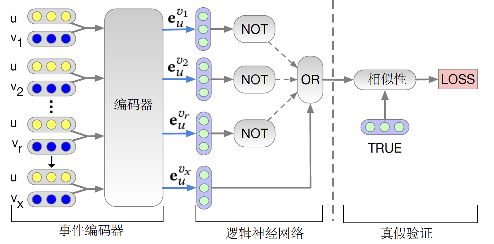
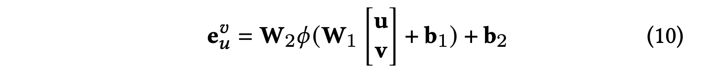

# NCR-Paddle

[English](./README.md) | 简体中文

----
[](REQUIRE)

----

## 一、简介

本项目基于paddlepaddle框架复现 Neural Collaborative Reasoning，NCR基于神经网络构成的协同推理架构，使用了逻辑正则化算子来训练OR、NOT单元，以实现对用户-物品交互embedding的推理。


### 论文摘要

现有的协同过滤（CF）方法大多是基于匹配的思想设计的，然而，作为一项认知而非感知的智能任务，推荐不仅需要数据的模式识别和匹配能力，还需要数据的认知推理能力。 本文中作者提出了协同推理（CR），提出了一个模块化的推理体系结构，学习且(∧) ,
或(∨) , 非（¬）等逻辑符号作为神经网络来实现蕴涵推理( →) 。

网络结构如下

[](IMG)

网络的embedding和逻辑单元均使用双层全连接，使用ReLU作为激活函数

[](IMG)

作者使用逻辑正则化来训练或（OR）、非（NOT）模块

[](IMG)


**论文:**
- [1] Chen, H. ,  Shi, S. ,  Y  Li, &  Y  Zhang. (2020). Neural collaborative reasoning.<br>

**参考项目：**
- [https://github.com/rutgerswiselab/NCR](https://github.com/rutgerswiselab/NCR)

**项目aistudio地址：**
- notebook任务：[https://aistudio.baidu.com/aistudio/projectdetail/2289941](https://aistudio.baidu.com/aistudio/projectdetail/2289941)

## 二、复现精度

>该列指标在ML100k数据集上的评价指标

| |N@5|N@10|HR@5|HR@10|
| :---: | :---: | :---: | :---: | :---: |
|ML100k|0.3794|0.4369|0.5446|0.7208|


**预训练模型：**
[预训练权重](saved_model/NCR/0.3653_0.4254_0.5287_0.7144best_test.model)


## 三、环境依赖

- 硬件：GPU、CPU

- 框架：
    - PaddlePaddle = 2.1.2

## 五、快速开始

### Step1: clone

```bash
# clone this repo
git clone https://github.com/gsq7474741/Paddle-NCR
```
**安装依赖**
```bash
pip install -r requirements.txt
```

### Step2: 训练
```bash
python ./main.py --rank 1 --model_name NCR --optimizer Adam --lr 0.001 --dataset ml100k01-1-5 --metric ndcg@5,ndcg@10,hit@5,hit@10 --max_his 5 --test_neg_n 100 --l2 1e-4 --r_weight 0.1 --random_seed 1 --gpu 1
```

此时的输出为：
```
Test Before Training = 0.0243,0.0432,0.0393,0.0987 ndcg@5,ndcg@10,hit@5,hit@10
Prepare Train Data...
Prepare Validation Data...
Init: 	 train= 0.8473,0.8473 validation= 0.0276,0.0463,0.0393,0.0977 test= 0.0243,0.0432,0.0393,0.0987 [6.9 s] ndcg@5,ndcg@10,hit@5,hit@10
Optimizer: Adam
Epoch     1:   5%|██▌                                              | 22/416 [00:04<01:17,  5.07it/s]
```


### Step3: 评估&预测
```bash
python ./main.py --rank 1 --train 0 --load 1 --model_name NCR --model_path ../model/NCR/0.3653_0.4254_0.5287_0.7144best_test.model --dataset ml100k01-1-5 --metric ndcg@5,ndcg@10,hit@5,hit@10 --max_his 5 --test_neg_n 100 --l2 1e-4 --r_weight 0.1 --random_seed 1 --gpu 0
```
此时的输出为：
```
Test Before Training = 0.0432,0.0612,0.0732,0.1295 ndcg@5,ndcg@10,hit@5,hit@10
Load saved_model from saved_model/NCR/0.3653_0.4254_0.5287_0.7144best_test.model
Test After Training = 0.3794,0.4369,0.5446,0.7208 ndcg@5,ndcg@10,hit@5,hit@10
Save Test Results to result/result.npy
```
预测结果存储为result/result.npy（可添加命令行参数指定存储路径）
`

## 六、代码结构与详细说明

### 6.1 代码结构


```
.
├── README.md                                            # readme
├── configs                                              # 配置
│    └── cfg.py                                          # 全局参数
├── data_loaders                                         # dataloaders
│    ├── DataLoader.py                                   #
├── data_processor                                       # 数据预处理
│    ├── DataProcessor.py                                #
│    ├── HisDataProcessor.py                             #
│    ├── ProLogicRecDP.py                                #
├── dataset                                              # 自带数据集
│    ├── 5MoviesTV01-1-5                                 #
│    │   ├── 5MoviesTV01-1-5.test.csv                    #
│    │   ├── 5MoviesTV01-1-5.train.csv                   #
│    │   └── 5MoviesTV01-1-5.validation.csv              #
│    ├── Electronics01-1-5                               #
│    │   ├── Electronics01-1-5.test.csv                  #
│    │   ├── Electronics01-1-5.train.csv                 #
│    │   └── Electronics01-1-5.validation.csv            #
│    ├── README.md                                       #
│    └── ml100k01-1-5                                    #
│        ├── ml100k01-1-5.info.json                      #
│        ├── ml100k01-1-5.test.csv                       #
│        ├── ml100k01-1-5.train.csv                      #
│        ├── ml100k01-1-5.train_group.csv                #
│        ├── ml100k01-1-5.validation.csv                 #
│        └── ml100k01-1-5.vt_group.csv                   #
├── log                                                  # log保存目录
│    └── README.md                                       #
├── main.py                                              # 主程序入口
├── models                                               # 模型代码
│    ├── BaseModel.py                                    # 模型基类
│    ├── CompareModel.py                                 #
│    ├── NCR.py                                          # NCR模型
│    ├── RecModel.py                                     #
├── readme_imgs                                          # readme图片
├── requirements.txt                                     # 依赖包
├── result                                               # 预测结果保存目录
│    ├── README.md                                       #
├── runners                                              # runner代码
│    ├── BaseRunner.py                                   #
│    ├── ProLogicRunner.py                               #
├── saved_model                                          # 模型保存目录
│    ├── NCR                                             #
│    │   ├── 0.3653_0.4254_0.5287_0.7144best_test.model  #
│    └── README.md                                       #
└── utils                                                # 工具
    ├── dataset.py                                       #
    ├── mining.py                                        #
    ├── rank_metrics.py                                  #
    └── utils.py                                         #

```


### 6.2 参数说明

可以在 `train.py` 中设置训练与评估相关参数，具体如下：

| 参数              | 类型  | 默认值                                                        | 说明                                                            |
|-------------------|-------|------------------------------------------------------------|-----------------------------------------------------------------|
| --load            | int   | 0                                                          | Whether load saved_model and continue to train                  |
| --epoch           | int   | 100                                                        | Number of epochs.                                               |
| --check_epoch     | int   | 1                                                          | Check every epochs.                                             |
| --early_stop      | int   | 1                                                          | whether to early-stop.                                          |
| --lr              | float | 0.01                                                       | Learning rate.                                                  |
| --batch_size      | int   | 128                                                        | Batch size during training.                                     |
| --eval_batch_size | int   | 128 * 128                                                  | Batch size during testing.                                      |
| --dropout         | float | 0.2                                                        | Dropout probability for each deep layer                         |
| --l2              | float | 0.0001                                                     | Weight of l2_regularize in loss.                                |
| --optimizer       | str   | 'GD'                                                       | optimizer: GD Adam Adagrad                                      |
| --metric          | str   | 'RMSE'                                                     | metrics: RMSE MAE AUC F1 Accuracy Precision Recall              |
| --skip_eval       | int   | 0                                                          | number of epochs without evaluation                             |
| --gpu             | str   | '0'                                                        | Set CUDA_VISIBLE_DEVICES                                        |
| --verbose         | int   | logging.INFO                                               | Logging Level 0 10 ... 50                                       |
| --log_file        | str   | cfg.DEFAULT_LOG                                            | Logging file path                                               |
| --result_file     | str   | cfg.DEFAULT_RESULT                                         | Result file path                                                |
| --random_seed     | int   | 2022                                                       | Random seed of numpy and pytorch                                |
| --train           | int   | 1                                                          | To train the saved_model or not.                                |
| --path            | str   | 'dataset/'                                                 | Input data dir.                                                 |
| --dataset         | str   | 'ml100k01-1-5'                                             | Choose a dataset.                                               |
| --sep             | str   | 't'                                                        | sep of csv file.                                                |
| --label           | str   | 'label'                                                    | name of dataset label column.                                   |
| --model_path      | str   | '../saved_model/%s/%s.pdiparams' % (model_name model_name) | Model save path.                                                |
| --u_vector_size   | int   | 64                                                         | Size of user vectors.                                           |
| --i_vector_size   | int   | 64                                                         | Size of item vectors.                                           |
| --r_weight        | float | 10                                                         | Weight of logic regularizer loss                                |
| --ppl_weight      | float | 0                                                          | Weight of uv interaction prediction loss                        |
| --pos_weight      | float | 0                                                          | Weight of positive purchase loss                                |
| --test_neg_n      | int   | 10                                                         | Negative sample num for each instance in test/validation set.   |
| --max_his         | int   | -1                                                         | Max history length.                                             |
| --sup_his         | int   | 0                                                          | If sup_his > 0 supplement history list with -1 at the beginning |
| --sparse_his      | int   | 1                                                          | Whether use sparse representation of user history.              |


## 七、模型信息

关于模型的其他信息，可以参考下表：

| 信息 | 说明 |
| --- | --- |
| 发布者 | 高崧淇、赖楚芸|
| 时间 | 2021.09 |
| 框架版本 | Paddle 2.1.2 |
| 应用场景 | 推荐系统 |
| 支持硬件 | GPU、CPU |
| 下载链接 | [预训练权重](saved_model/NCR/0.3653_0.4254_0.5287_0.7144best_test.model)  |
| 在线运行 | [notebook](https://aistudio.baidu.com/aistudio/projectdetail/2289941)|
